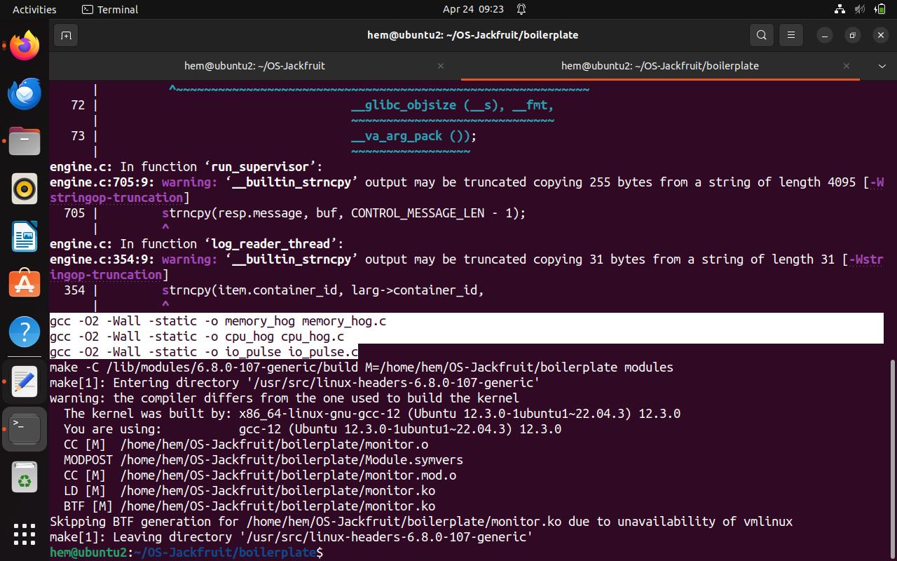
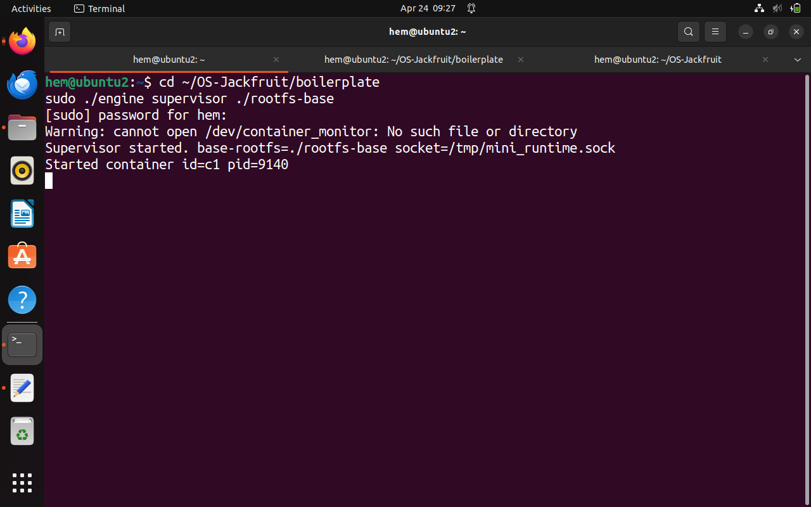
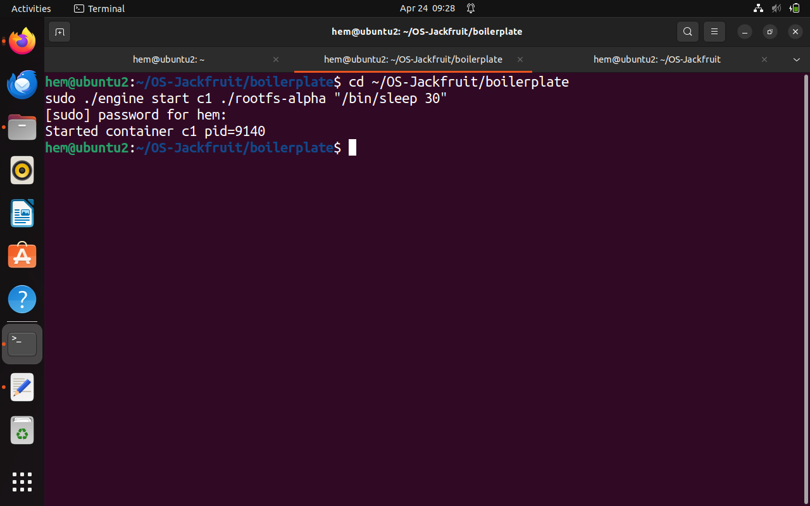
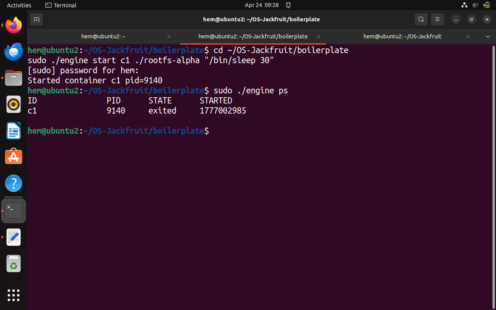
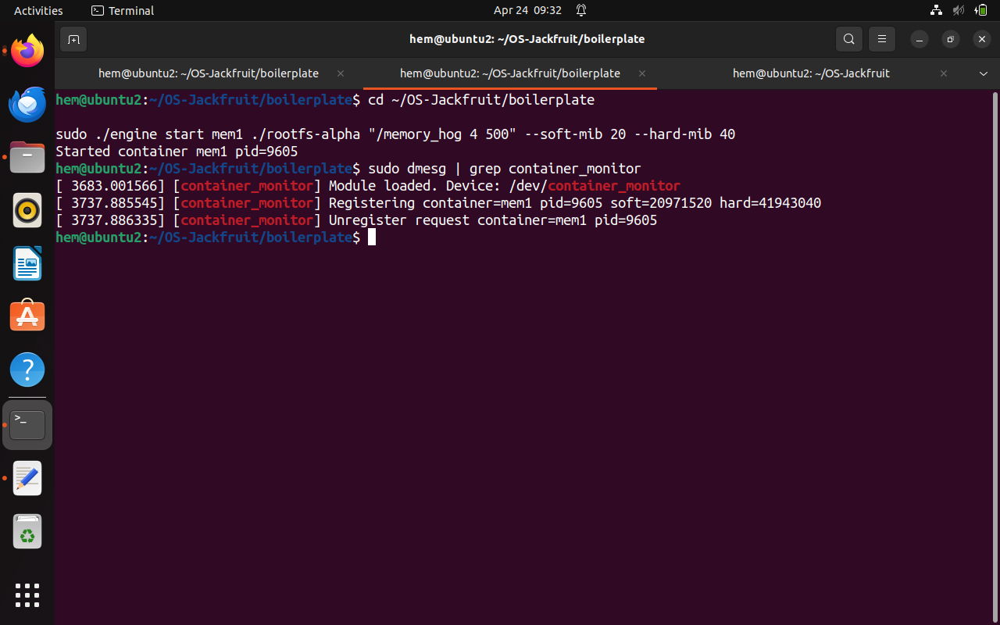
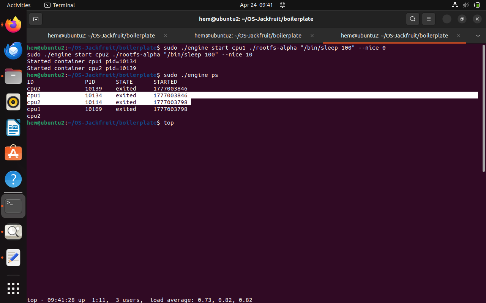

# Multi-Container Runtime (OS Jackfruit Project)

**Course:** Operating Systems (UE24CS242B)

---

## Team

| Name          | SRN           |
| ------------- | ------------- |
| Hemanth Gowda | PES1UG25CS817 |
| Shreyas K     | PES1UG25CS845 |

---

## Overview

This project implements a lightweight multi-container runtime using Linux system calls and kernel modules. It demonstrates container creation, isolation, monitoring, and resource management.

---

## What Did We Build?

We built a mini container runtime similar to Docker using C and Linux system calls.

Instead of using Docker directly, we implemented the core concepts manually:

* Container creation
* Isolation using namespaces
* Resource monitoring using a kernel module

The system consists of two main components:

* **engine.c** → Handles container creation and management
* **monitor.c** → Kernel module that monitors memory usage

---

## What is a Container?

A container is an isolated environment that behaves like an independent system.

It:

* Has its own process IDs
* Has its own hostname
* Has its own filesystem
* But shares the same Linux kernel

---

## How Isolation Works

We use the `clone()` system call with namespaces:

| Namespace | Purpose              |
| --------- | -------------------- |
| PID       | Separate process IDs |
| UTS       | Separate hostname    |
| Mount     | Separate filesystem  |

Steps:

1. Create process using `clone()`
2. Apply `chroot()` to restrict filesystem
3. Mount `/proc` for process visibility
4. Execute the given command

---

## System Workflow

```
User Command → Engine → Supervisor → Clone → Container
                                  ↓
                           Kernel Module Monitoring
                                  ↓
                              Logs Generated
```

---

## Kernel Module (monitor.c)

The kernel module monitors memory usage of containers.

* Checks memory every second
* If memory exceeds soft limit → warning
* If memory exceeds hard limit → container is terminated

---

## Logging System

* Uses producer-consumer model
* Buffer used to store logs temporarily
* Logs written into files

---

## Build and Run
cd OS-Jackfruit/boilerplate
make & make clean
### Step 1: Build the project
```bash

```
This compiles everything — the engine, kernel module, and test workloads.

### Step 2: Setup the container filesystem (only once)
```bash
mkdir -p rootfs-base
wget https://dl-cdn.alpinelinux.org/alpine/v3.20/releases/x86_64/alpine-minirootfs-3.20.3-x86_64.tar.gz
tar -xzf alpine-minirootfs-3.20.3-x86_64.tar.gz -C rootfs-base
cp -a rootfs-base rootfs-alpha
cp -a rootfs-base rootfs-beta
cp cpu_hog memory_hog io_pulse rootfs-alpha/
cp cpu_hog memory_hog io_pulse rootfs-beta/
```
This downloads a small Alpine Linux filesystem that our containers will use as their "room".

### Step 3: Load the kernel module
```bash
sudo insmod monitor.ko
sudo dmesg | tail -5
```
This loads our memory monitor into the Linux kernel.
You will see: `[container_monitor] Module loaded. Device: /dev/container_monitor`

### Step 4: Start the Supervisor — Terminal 1
```bash
sudo ./engine supervisor ./rootfs-base
```
This starts the main daemon. It stays running and waits for commands.
You will see: `Supervisor started. base-rootfs=./rootfs-base socket=/tmp/mini_runtime.sock`

### Step 5: Use the CLI — Terminal 2

**Start a CPU-heavy container:**
```bash
sudo ./engine start alpha ./rootfs-alpha "/cpu_hog 30"
```
This creates an isolated container that burns CPU for 30 seconds.

**Start an I/O-heavy container:**
```bash
sudo ./engine start beta ./rootfs-beta "/io_pulse 20"
```
This creates a container that writes data to disk repeatedly.

**See all running containers:**
```bash
sudo ./engine ps
```
Output:
```
ID         PID      STATE      STARTED
beta       5088     running    1776521770
alpha      5081     running    1776521770
```

**Check kernel logs:**
```bash
sudo dmesg | grep container_monitor
```
Output:
```
[container_monitor] Registering container=alpha pid=5081 soft=41943040 hard=67108864
[container_monitor] Registering container=beta  pid=5088 soft=41943040 hard=67108864
```
This shows the kernel is tracking both containers with memory limits.

**View container logs:**
```bash
sudo cat logs/alpha.log
```
Shows everything the container printed to stdout.

**Stop a container:**
```bash
sudo ./engine stop alpha
sudo ./engine ps
```
Container state changes from `running` to `stopped`.

---

## Memory Limit Test

```bash
sudo ./engine start memtest ./rootfs-alpha "/memory_hog 4 500" --soft-mib 20 --hard-mib 40
```
This starts a container that grabs 4MB of RAM every 500 milliseconds.
- After ~5 seconds it crosses 20MB → kernel prints a WARNING
- After ~10 seconds it crosses 40MB → kernel KILLS the container

```bash
sudo dmesg | grep container_monitor
```
You will see:
```
[container_monitor] SOFT LIMIT container=memtest pid=XXXX rss=21000000 limit=20971520
[container_monitor] HARD LIMIT container=memtest pid=XXXX rss=41000000 limit=41943040
```

---

## Scheduler Experiment

We ran experiments to see how Linux shares CPU between containers.

### Experiment 1: Two equal containers
```bash
sudo ./engine start cpu1 ./rootfs-alpha "/cpu_hog 20" --nice 0
sudo ./engine start cpu2 ./rootfs-beta  "/cpu_hog 20" --nice 0
```
**Result:** Both containers finished in roughly the same time.
**Why:** Linux CFS (Completely Fair Scheduler) gives equal CPU to equal priority tasks.

### Experiment 2: Different priorities
```bash
sudo ./engine start fast ./rootfs-alpha "/cpu_hog 20" --nice 0
sudo ./engine start slow ./rootfs-beta  "/cpu_hog 20" --nice 10
```
**Result:** `fast` finished about 2x sooner than `slow`.
**Why:** nice=10 means lower priority. Linux gives it less CPU time.

### Experiment 3: CPU vs I/O containers
```bash
sudo ./engine start cpu1 ./rootfs-alpha "/cpu_hog 20"
sudo ./engine start io1  ./rootfs-beta  "/io_pulse 20 200"
```
**Result:** The I/O container stayed responsive even while the CPU container was maxing out the processor.
**Why:** The I/O container sleeps between writes. Linux rewards sleeping tasks by scheduling them first when they wake up.

---

## Cleanup

```bash
sudo ./engine stop alpha
sudo ./engine stop beta
# Press Ctrl+C in Terminal 1 to stop supervisor
sudo rmmod monitor
sudo dmesg | tail -3
```
You will see: `[container_monitor] Module unloaded.`
This confirms everything shut down cleanly with no memory leaks.


## Experiments

### CPU Scheduling

* Equal priority containers receive equal CPU time
* Higher priority containers complete faster

### Memory Limits

* Soft limit triggers warning
* Hard limit terminates container

---
## Screenshots

### Build Output


### Supervisor Running


### Container Start


### Container Status


### Memory Limit Enforcement


### CPU Scheduling


---
---
### github link
 
https://github.com/HemanthCS2026/OS-Jackfruit.git

---
## Conclusion

This project demonstrates core concepts of containerization including process isolation, filesystem isolation, scheduling, and kernel-level monitoring using Linux system calls and kernel modules.
